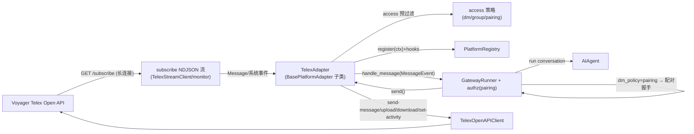

# Hermes Telex Platform Plugin：技术设计

## 0. 背景与定位

- **协议基准**：[Telex Open API Guide](../../../../voyager/docs/references/telex-openapi.md)——subscribe 流、block 模型、
  send-message（含流式）、系统事件、鉴权（X-API-Key）。
- **功能基准**：[openclaw-telex](../../../openclaw-telex/src/)（OpenClaw 的 Telex channel 插件，TS 实现）。
  **hermes-telex 需完成 openclaw-telex 的全部功能**（见 §12 功能对标清单），差异仅两点：
  1. 宿主从 OpenClaw 换成 hermes-agent（注册/会话/工具接口不同）；
  2. 配置从 JSON `channels.telex.*` 翻译为 hermes 的 YAML `platforms.telex.extra.*`（§5）。
- **接入基准**：hermes-agent 当前推荐的 Plugin Path（`ctx.register_platform()` + hooks），
  **零 hermes-agent 改动、零 monkey-patch**（IRC 范本）。

> **与 hermes-seatalk 的差别**：seatalk 用 4 处 monkey-patch 且**不支持 pairing**；hermes-telex 用现代 hooks，
> 且 **dm_policy=pairing 由 hermes-agent 网关内建配对能力承接**（`gateway/authz_mixin.py`），无需自建配对控制器。

### 0.1 前置依赖状态

| 项 | 状态 |
|---|---|
| hermes-agent 源码 | ✅ `/Users/yuy/Work/project/ai-study/ref/hermes-agent`，接口按真实源码核对 |
| openclaw-telex 源码 | ✅ `openclaw/openclaw-telex`（与 hermes-telex 同级），功能对标基准 |
| Telex Bot 注册 / Key 颁发 | ✅ voyager 代码已查清（§2） |
| 网关配对（pairing） | ✅ hermes-agent 内建：`pairing_store.is_approved()` + `_adapter_dm_policy()` + 配对握手（§6.3） |
| 网关流式发送 | ✅ 支持，但 openclaw-telex 不用流式（COMPLETED 一次性），故**对标基线为一次性**；流式列为可选增强 |

编码期仅余核对：默认 `_parse_target_ref` 对含 `/`/`@` ref 的行为；`_send_via_adapter` 的 media 转发链路（§9）。

---

## 1. 架构



Telex 特性沿用 §0 协议基准：单一 subscribe 入站、单一 X-API-Key、无 thread、block 模型、消息追加式流式（本插件用一次性）。

---

## 2. Voyager Telex Bot 注册与 Key 颁发

外部插件以一个 **Telex BOT identity** 接入；`X-API-Key` 即 bot 的 OpenAPI key。

- identity kind：USER(0)/MATE_INSTANCE(1)/**BOT(2)**；BOT 由某 user 拥有（`OwnerUserId`）。
- key 存于 `open_api_key_tab`，`SubjectKind=TELEX_BOT`、`Scopes="telex"`，**只存 SHA3-256 哈希**，明文仅颁发时返回一次。
- 鉴权：`x-api-key` → 哈希查（60s 缓存，仅 ACTIVE）→ 解析为 bot identity，权限按 bot `OwnerUserId`。

| 操作 | RPC | HTTP |
|---|---|---|
| 注册 bot（同时颁发首个 key） | `TelexRegisterBot` | `POST /voyager/v1/telex/register-bot` |
| 轮换 key | `TelexRotateBotKey` | `POST /voyager/v1/telex/rotate-bot-key` |
| 列出 bot | `TelexListBots` | `POST /voyager/v1/telex/list-bots` |
| 注销 bot | `TelexUnregisterBot` | `POST /voyager/v1/telex/unregister-bot` |

运维：以 bot 归属 user 身份调 `register-bot`（web SDK `telexService.registerBot` / 带 session 的 HTTP）→ 保存一次性 `plaintext_key`（→ `api_key`）与 `bot.id`（→ `bot_id`，硬化自发消息抑制）。丢失只能轮换。

---

## 3. 接入方式：现代 Plugin Path（零 monkey-patch）

`register(ctx)` 经 `ctx.register_platform(PlatformEntry(...))` + hooks，插件系统自动处理 adapter 创建、
配置解析、cron 投递、send_message 路由、系统提示、状态、setup（`ADDING_A_PLATFORM.md`）。IRC 为零-patch 范本。

```python
def register(ctx):
    ctx.register_platform(PlatformEntry(
        name="telex", label="Telex", emoji="📨",
        adapter_factory=lambda cfg: TelexAdapter(cfg),
        check_fn=check_telex_requirements,
        validate_config=_validate_telex_config,
        is_connected=_is_telex_connected,
        setup_fn=_telex_setup_wizard,
        env_enablement_fn=_telex_env_enablement,      # env 快速启用 + home_channel
        apply_yaml_config_fn=_telex_apply_yaml,        # 拥有 platforms.telex YAML 架构（§5）
        cron_deliver_env_var="TELEX_HOME_CHANNEL",     # cron 投递（替代 seatalk patch）
        standalone_sender_fn=_telex_standalone_send,   # 进程外 cron 发送
        required_env=["TELEX_API_KEY"],                # 仅 env 快速启用需要；YAML 路径不强制
        max_message_length=MAX_MESSAGE_LENGTH,
        platform_hint=_TELEX_PLATFORM_HINT,
        plugin_name="telex-platform", source="plugin",
        # 访问策略由插件自身承接（见 §6）：不使用 allowed_users_env/allow_all_env
    ))
    register_telex_tool(ctx)   # §7 telex 工具
```

> 访问控制**不**走 `allowed_users_env`：hermes-telex 复刻 openclaw-telex 的策略模型，`TelexAdapter.enforces_own_access_policy=True`，
> 网关信任插件的入站过滤；唯 `dm_policy=pairing` 例外，交由网关配对握手（§6.3）。

三个 callback：`check_telex_requirements()`（有 api_key + aiohttp 可导入）/ `_validate_telex_config(cfg)`（api_key 非空）/
`_is_telex_connected(cfg)`（同 validate，不查 live adapter，避免启动鸡生蛋）。`Platform("telex")` 由 `_missing_` 动态创建。

`env_enablement_fn` / `apply_yaml_config_fn` 分别承接 env 快速启用与 YAML 架构翻译（§5），并 seed `home_channel`。

---

## 4. 仓库结构

```
hermes-telex/                ← plugin root (~/.hermes/plugins/telex/)
├── plugin.yaml              # kind: platform；name: telex-platform；requires_env/optional_env 富描述
├── pyproject.toml / requirements.txt (aiohttp>=3.9) / __init__.py / adapter.py(root shim) / env.example
├── hermes_telex/
│   ├── adapter.py           # TelexAdapter + register(ctx) + callbacks + hooks + enforces_own_access_policy/_dm_policy
│   ├── client.py            # Telex OpenAPI client（X-API-Key）+ 缓存 + 自发抑制 + backfill watermark
│   ├── stream.py            # subscribe NDJSON + 心跳 stale + 重连退避（monitor 职责）
│   ├── dispatcher.py        # Message→MessageEvent：watermark/dedup/skip/access/内容抽取/fork/mention 回填
│   ├── access.py            # dm/group 策略（open/allowlist/pairing、disabled/allowlist/open、sender allowlist、require_mention）
│   ├── accounts.py          # 多账号解析与合并（accounts.<id> 覆盖）
│   ├── blocks.py            # block 构造/解析
│   ├── media.py             # 入站下载落 cache / 出站上传（≤20 MiB）
│   ├── targets.py           # target 解析/格式化
│   ├── tools.py             # telex 工具（6 只读 action，逐项开关）
│   └── (streaming.py)       # 可选：非对标基线的原生流式（§6.4）
├── docs/{spec,test}/  ·  scripts/local-test.sh  ·  README.md
```

---

## 5. 配置（openclaw `channels.telex` → hermes YAML `platforms.telex.extra`）

配置载体从 openclaw 的 JSON 翻译为 hermes 约定的 `~/.hermes/config.yaml`，键 camelCase→snake_case，
沿用 hermes-seatalk 的 `platforms.<p>.extra.accounts.<id>` 结构。hermes 已把 `platforms.telex.extra` 通用
加载进 `PlatformConfig.extra`，插件直接读取（无需 `apply_yaml_config_fn`）。

> **Voyager 现网格式（权威）**：每个账号（含默认）都放在 `extra.accounts.<id>` 下，单账号即 `accounts.default`
> （见下方示例的 `accounts.support` 同构；顶层 extra 可为空，仅含 `accounts`）。`accounts.py` 对任一 id（含 `default`）
> 都用 `accounts.<id>` 覆盖顶层；无 `accounts` 键时退化为顶层单账号（env 快速启用路径）。base_url 用 VM 内可达地址
> （如 `http://192.168.100.1:8000`）。

```yaml
platforms:
  telex:
    enabled: true
    extra:
      # 顶层即默认账号；多账号在 accounts.<id> 覆盖
      api_key: "<plaintext bot api key>"
      base_url: "https://voyager.ingarena.net"
      bot_id: "0a1b2c3d4e5f6071"            # 可选，自发消息抑制（首帧即生效）
      dm_policy: allowlist                    # open | allowlist | pairing
      allow_from: ["alice@company.com", "0a1b2c3d4e5f6071"]
      group_policy: disabled                  # disabled | allowlist | open
      group_allow_from: ["<channel conversation id>"]
      group_sender_allow_from: ["alice@company.com"]
      group_require_mention: true
      processing_indicator: activity          # activity | off
      tools:
        search_identities: true
        get_identities: true
        list_conversations: true
        get_conversation_info: true
        list_members: true
        get_conversation_messages: true
      accounts:                               # 可选：多 bot
        support:
          api_key: "<another bot key>"
          dm_policy: open
          allow_from: ["*"]
```

**键翻译对照**（openclaw → hermes）：`apiKey→api_key`、`baseUrl→base_url`、`botId→bot_id`、`dmPolicy→dm_policy`、
`allowFrom→allow_from`、`groupPolicy→group_policy`、`groupAllowFrom→group_allow_from`、
`groupSenderAllowFrom→group_sender_allow_from`、`groupRequireMention→group_require_mention`、
`processingIndicator→processing_indicator`、`tools.searchIdentities→tools.search_identities`（其余同理）、
`accounts.<id>.*→accounts.<id>.*`。

**默认值**（与 openclaw 一致）：`base_url=https://voyager.ingarena.net`、`dm_policy=allowlist`、`group_policy=disabled`、
`group_require_mention=true`、`processing_indicator=activity`、所有 tools=true。
**校验**：`dm_policy=open` 要求 `allow_from` 含 `"*"`（否则拒绝启动）。

**env 快速启用（单账号，可选）**：`TELEX_API_KEY`（必）、`TELEX_BASE_URL`、`TELEX_BOT_ID`、`TELEX_DM_POLICY`、
`TELEX_ALLOW_FROM`、`TELEX_GROUP_POLICY`、`TELEX_GROUP_ALLOW_FROM`、`TELEX_GROUP_SENDER_ALLOW_FROM`、
`TELEX_GROUP_REQUIRE_MENTION`、`TELEX_PROCESSING_INDICATOR`、`TELEX_HOME_CHANNEL[_NAME]`。
env 由 `env_enablement_fn` seed 进 `extra`；YAML 为完整能力载体，env 优先级高于 YAML（`not os.getenv` 守卫）。

> 多账号：`accounts.<id>` 覆盖顶层，`accounts.py` 合并（enabled = 顶层 && account，configured = 有 api_key）。
> **注意**（网关配对限制）：hermes-agent 的 pairing 按 platform 维度存储，跨账号不区分；多账号 + pairing 时
> `_dm_policy` 暴露主账号策略，配对审批对该 platform 全局生效——多账号 pairing 场景需在文档说明此限制。

---

## 6. 访问控制（复刻 openclaw access.ts + 网关配对）

`TelexAdapter.enforces_own_access_policy = True`：网关信任插件入站过滤（`authz_mixin.py:237`），
唯 `dm_policy=pairing` 例外——插件转发 DM，网关跑配对握手（`authz_mixin.py:58-88, 215-249`）。
adapter 暴露 `_dm_policy`（解析后的 dm_policy）供网关识别 pairing。

### 6.1 DM 策略（open / allowlist / pairing）

dispatcher 对 1:1 chat：
- `allowlist`：`allow_from` 匹配才放行（规则见 §6.4）；否则 drop。
- `open`：放行全部（配置校验已保证 `allow_from` 含 `"*"`）。
- `pairing`：**不**在插件预过滤——转发给网关；网关 `pairing_store.is_approved(platform, user_id)` 命中即授权，
  否则发放配对码走审批。插件只需保证 `send()` 可用（网关经 adapter 发码）。

### 6.2 Group/Channel 策略（disabled / allowlist / open）+ mention

dispatcher 对 channel（复刻 `access.ts::checkGroupAccess`）：
- `disabled`：drop 全部 channel 消息。
- `allowlist`：`conversation_id ∈ group_allow_from` 才继续。
- `open`：全部 channel。
- `group_sender_allow_from` 非空：sender 须匹配（§6.4），否则 drop。
- `group_require_mention`（默认 true）：仅当 bot 被 @（`data.mention_ids` 含自身 或 `mention_all`）才触发；
  未 @ 静默 drop，并把跳过的消息作为**后续 @ 命中时的 thread 上下文**回填（§8）。

### 6.3 网关配对握手（委托）

hermes-agent 内建（`gateway/authz_mixin.py`）：pairing 模式下 DM 到达网关 → 查 `pairing_store` →
未批准则发配对码、记 pending；批准后入库，后续放行。**hermes-telex 无需自建配对控制器**（优于 openclaw）。
插件职责：dm_policy=pairing 时不预过滤、`_dm_policy="pairing"`、`user_id` 设为可审批标识（email 优先，见 §8）。

### 6.4 allowlist 匹配规则（复刻 `isTelexSenderAllowed`）

逐项 trim；`"*"` 全通过；等于 `sender_id` 通过；等于 email（大小写不敏感）通过。allow_from/group_sender_allow_from 共用。

---

## 7. 组件设计

### 7.1 TelexAdapter（adapter.py）

`BasePlatformAdapter` 子类；`send(chat_id, content, reply_to=None, metadata=None)`。关键成员/方法：

| 项 | 说明 |
|---|---|
| `enforces_own_access_policy=True` / `_dm_policy` | 见 §6 |
| `connect()/disconnect()` | 启停 stream/monitor（多账号并行，§7.4）；解析自身 identity |
| `send()` | 出站文本，一次性 COMPLETED（§6.4/§7.5） |
| `send_typing()` | set-activity `processing`；`processing_indicator=activity` 时每 3s 保活（openclaw TYPING_KEEPALIVE_MS） |
| `send_image/send_image_file/send_document` | upload-file → media block |
| `get_chat_info()` | get-conversation → `{name,type,chat_id}` |
| `_resolve_target()` | `<conversation_id>`→conversation_id；`peer/<id>`→peer_id；`email/<x>`→batch-get-identities→peer_id（失败返回可读 error，负向缓存 10min） |

自发消息抑制（复刻 client.ts）：`self_id` 学习自每次 send 响应的 `sender_id` + 配置 `bot_id`（首帧即生效）+ 已发 message id LRU（2000）；`is_own_message(msg)=self_id 命中 或 id∈已发`。

### 7.2 Telex OpenAPI Client（client.py）

`aiohttp` + `X-API-Key`；HTTP 超时 15s（API）/60s（文件）；base_url 去尾斜杠。方法（映射 OpenAPI + openclaw client）：
identities（search/batch-get/resolve+缓存）、conversations（list/get[10min 缓存,forceRefresh]/create-chat/create-channel）、
members（list/add）、messages（list/send/set-activity）、files（upload≤20MiB/download）。
backfill watermark：per-conversation `{settled, pending:set}`，`get_backfill_targets()` 返回 after_seq（夹在 pending 之下，避免跳过 IN_PROGRESS）。
dedup：`mark_processed(id)` 首见 true。错误体 `{code,message}` 映射统一异常；**不记 API Key**。全局 client 按 `base_url:api_key` 复用。

### 7.3 Subscribe Stream / Monitor（stream.py）

单一入站。逐行 `json.loads`：`result.message` 真实消息/系统事件→dispatcher；`result.message=null` 心跳→reset stale；`error` 帧→重连。
心跳 stale 60s（任意帧 reset）；重连指数退避 1s→30s（×2）；**HTTP 401/403 视为致命**（不重连）。
readiness 帧后先 seed 每会话 backfill（`list-messages` 分页 100/页、最多 50 页，超页 warn），再放行 live 帧（保序）。

### 7.4 Dispatcher（dispatcher.py）

复刻 bot.ts 主流程，产出 `MessageEvent`+`SessionSource`（`build_source`）→`handle_message`：
1. **watermark**：任何帧先记 seq/终态（backfill 用），早于过滤。
2. **自发抑制**：`is_own_message` → drop。
3. **状态/标志门**：skip IN_PROGRESS（保险）、skip `flags&EVENT`（走系统事件同步）、skip `flags&FORK_PREFIX`（fork 前拷贝历史，仅作上下文）、按 id **dedup**（backfill/live 重叠）。
4. **access**：channel→§6.2；dm→§6.1。
5. **内容抽取**：拼 TEXT block；IMAGE/VIDEO/AUDIO/FILE 经 media.py 下载落 cache→`media_urls/media_types`（占位符 `[image: name]` 等）；THINKING/TOOL 入站忽略。
6. **fork**：`fork_of_conversation_id` 存在→继承父会话 session（parentSessionKey）；首轮拉 fork 前历史（limit 50，FORK_PREFIX，COMPLETED，按 seq）作上下文。
7. **mention 回填**：require_mention channel 且距上轮有 gap→拉漏掉的消息（limit 50）作 thread 上下文。
8. **身份解析**：`sender_id`→batch-get-identities→email/display_name（缓存），设 `user_id`(email 优先)/`user_id_alt`(id)/`user_name`。
9. **per-conversation 串行**：同 `account:conversation` 排队，一次一轮 agent；不同会话并发。

`SessionSource`：`chat_type=dm|group`、`chat_id=conversation_id`、`thread_id=None`。

### 7.5 出站（outbound）+ media

一次性 COMPLETED（对标 openclaw，禁 block streaming）：文本经 markdown chunk（`TELEX_TEXT_CHUNK_LIMIT`，openclaw=200000 字符，远低于 1 MiB）分多条；文本+媒体合并为一条多 block 消息。
media.py：入站 download-file 落 shared cache（≤20 MiB，MIME 探测）；出站 `media://`/`~`/`file://`/`http(s)` 解析→upload-file（≤20 MiB）→media block，失败降级 `[attachment unavailable: ...]`。

### 7.6 系统事件

`flags&EVENT` 且 block `type=21`：created/deleted/renamed/member_added/member_removed/member_joined → 更新本地会话标题/成员缓存；不作内容回复；未知 kind 忽略。

---

## 8. 会话路由与上下文

- session key：per `account:conversation`；chat→direct、channel→channel（get-conversation 判 kind，异常降级 channel）。
- context payload（对齐 openclaw）：`from="telex:<sender_id>"`、sender{id,name}、conversation{kind,id}、
  route{agent,account,session,parentSession?}、access{mentions.can_detect(=channel), mentions.was_mentioned}、media、supplemental.thread（fork/mention 回填历史）。
- 授权标识：`user_id` 用 sender email（网关 pairing/allowlist 按之匹配）；无 email 回退 identity_id。

---

## 9. send_message 与 cron

target：`telex:<conversation_id>` / `telex:peer/<identity_id>` / `telex:email/<email>`。live adapter 在线经 `_send_via_adapter`（透传 media）；离线 cron 经 `standalone_sender_fn`。cron：`deliver="telex"`→`TELEX_HOME_CHANNEL`（`cron_deliver_env_var`）。

---

## 10. 数据模型（内存/本地）

dedup（LRU max 1000/2000，TTL 30min）、self 已发 id LRU(2000)、identity 缓存(24h)、conversation 缓存(10min)、每会话 watermark（常驻，进程重启冷启动、不回填停机期间消息）、inbound media（hermes cache）。**配对审批状态由网关 `pairing_store` 持久化**，不在插件内。

---

## 11. 安全 / 可观测性

- API Key 仅 env/YAML 注入，不入库；日志 mask（可记后 4 位）。全程 HTTPS，无回调/签名。
- 默认 deny：dm_policy 默认 allowlist、group_policy 默认 disabled、channel 默认 require_mention。`dm_policy=open` 记安全告警（openclaw 同）。
- subscribe 含自发消息——务必自发抑制，防自激。
- 日志子系统：subscribe/inbound/backfill/outbound/media/access/pairing；字段 account/conversation/message/seq/sender/reason；**不记 key 与正文明文**。
- `hermes gateway status`：静态 `is_connected`；运行时 health（stream connected、base_url、账号数、last error、自身 display_name）。

---

## 12. openclaw-telex 功能对标清单（验收基线）

| 功能 | 对标点 | hermes-telex |
|---|---|---|
| subscribe 单流入站 + NDJSON + 心跳 60s + 退避 1s→30s | client/monitor | §7.3 |
| 重连 backfill（after_seq，避开 pending IN_PROGRESS） | client watermark | §7.2/7.3 |
| dedup（backfill/live 重叠） | mark_processed | §7.4 |
| 自发抑制（self_id 学习 + bot_id + 已发 id LRU2000） | client | §7.1 |
| skip IN_PROGRESS / EVENT / FORK_PREFIX | bot.ts | §7.4 |
| dm_policy open/allowlist/**pairing** | access + 网关 | §6.1/6.3 |
| group_policy disabled/allowlist/open + sender allowlist + require_mention | access.ts | §6.2 |
| allowlist 规则（`*`/id/email 不敏感） | isTelexSenderAllowed | §6.4 |
| 内容抽取 + 媒体自动下载（≤20MiB）+ 占位符 | media | §7.4/7.5 |
| fork 继承 + fork 前历史（50） | bot.ts | §7.4 |
| mention 回填 thread 上下文（50） | bot.ts | §7.4 |
| processing_indicator activity/off + 3s 保活 | send-activity | §7.1 |
| 出站一次性 COMPLETED + 文本分片(200k) + 文本/媒体多 block | send/outbound | §7.5 |
| 出站上传（media://,~,file://,http；≤20MiB；失败降级） | media | §7.5 |
| telex 工具 6 action，逐项开关 | tool | §7 tools + §13 |
| 多账号 accounts.<id> 覆盖合并 | accounts | §5/§7.4 |
| 系统事件状态同步 | bot.ts | §7.6 |
| setup wizard（key/base/probe/policies/indicator/allowlist） | setup-surface | §14 |
| probe 连接校验（getIdentities([],[])） | probe.ts | check/setup |
| 配置 = channels.telex 的 YAML 等效 | config-schema | §5 |

---

## 13. telex 工具（tools.py）

工具名 `telex`，6 只读 action（逐项 `tools.<name>` 开关，默认全开），**不用于发送**：
`search_identities`(query,limit) / `get_identities`(ids,emails) / `list_conversations`(kind,offset,limit) /
`get_conversation_info`(conversation_id, forceRefresh) / `list_members`(conversation_id, 解析身份) /
`get_conversation_messages`(conversation_id,before_seq,after_seq,limit, 升序)。输出 JSON，枚举转小写标签、flags 转标签列表。

---

## 14. setup wizard（复刻 setup-surface.ts）

1. api_key（必）+ base_url（默认 prod）；2. probe 测连（延迟/错误）；3. group_policy（disabled/allowlist/open）；
4. allowlist→录入 conversation ids；5. 非 disabled→是否限制 sender→录入；6. processing_indicator；
7.（如需）DM allowlist；8. dm_policy（open/allowlist/pairing）。录入按 `\n,;` 切分去重。

---

## 15. 出站流式（可选，超出对标基线）

openclaw-telex 不使用流式（COMPLETED 一次性），故**对标基线为一次性**（§7.5）。若后续要 Telex 实时打字效果，
可选实现 `supports_draft_streaming()` + `send_draft`：把网关 draft 累计全文帧映射为 Telex 追加（delta，status=1），
`send()` 收尾 finalize 现有 IN_PROGRESS（status=0，避免重复终稿）。封装在 `streaming.py`，不影响对标功能。

---

## 16. 开放问题

| # | 问题 | 决策 |
|---|---|---|
| Q-1 | 接入方式 | 现代 Plugin Path + hooks，零 patch |
| Q-2 | 访问策略 | 插件内 enforces_own_access_policy；pairing 委托网关 `pairing_store`（§6.3） |
| Q-3 | 出站流式 | 对标基线一次性 COMPLETED；流式为可选增强（§15） |
| Q-4 | 自身 identity | `bot_id` 配置 + 首发响应学习 |
| Q-5 | 多账号 + pairing | 网关 pairing 按 platform，跨账号不分；文档标注限制（§5） |
| Q-6 | THINKING/TOOL 入站块 | 忽略（对标 openclaw） |

---

## 附录 A：关键参考路径

| 路径 | 用途 |
|---|---|
| `voyager/docs/references/telex-openapi.md` | Telex 协议（权威） |
| `openclaw/openclaw-telex/src/*` | 功能对标基准（bot/access/client/monitor/send/media/tool/config-schema/accounts/setup-surface） |
| `hermes-agent/gateway/platforms/ADDING_A_PLATFORM.md` | Plugin Path + hooks |
| `hermes-agent/gateway/authz_mixin.py` | 网关配对/自有策略（`enforces_own_access_policy`、`_dm_policy`、`pairing_store`） |
| `hermes-agent/plugins/platforms/irc/adapter.py` | 零-patch register(ctx) 范本 |
| `hermes-agent/gateway/platforms/base.py` | BasePlatformAdapter/SendResult/MessageEvent/build_source/cache_* |
| `hermes-agent/gateway/platform_registry.py` | PlatformEntry（apply_yaml_config_fn/env_enablement_fn/cron_deliver_env_var/standalone_sender_fn） |
| `voyager/server/internal/domain/telex_identity.go` | bot 注册/轮换/key 颁发 |
